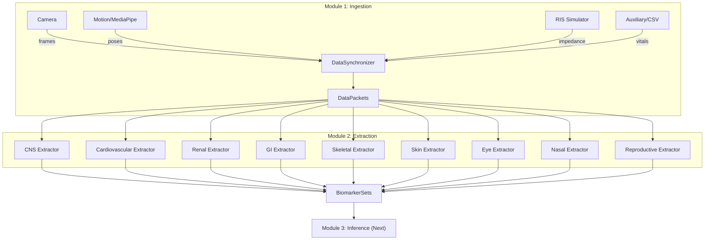

# Health Screening Pipeline - Technical Manual

This manual provides detailed documentation of every component built for the multimodal health screening system.

---

## Table of Contents

1. [Project Structure](#project-structure)
2. [Core Infrastructure](#core-infrastructure)
3. [Module 1: Data Ingestion](#module-1-data-ingestion)
4. [Module 2: Feature Extraction](#module-2-feature-extraction)
5. [Module 3: Baseline AI Inference](#module-3-baseline-ai-inference)
6. [Testing](#testing)
7. [Data Flow Diagram](#data-flow-diagram)

---

## Project Structure

```
fastapi2/
├── app/
│   ├── __init__.py              # App package initialization
│   ├── config.py                # Application configuration
│   ├── core/
│   │   ├── __init__.py
│   │   ├── ingestion/           # Module 1: Data Ingestion
│   │   │   ├── __init__.py
│   │   │   ├── sync.py          # DataPacket, DataSynchronizer
│   │   │   ├── camera.py        # CameraIngestion
│   │   │   ├── motion.py        # MotionIngestion
│   │   │   ├── ris.py           # RISSimulator
│   │   │   └── auxiliary.py     # AuxiliaryIngestion
│   │   ├── extraction/          # Module 2: Feature Extraction
│   │   │   ├── __init__.py
│   │   │   ├── base.py          # BaseExtractor, BiomarkerSet
│   │   │   ├── cns.py           # CNSExtractor
│   │   │   ├── cardiovascular.py
│   │   │   ├── renal.py
│   │   │   ├── gastrointestinal.py
│   │   │   ├── skeletal.py
│   │   │   ├── skin.py
│   │   │   ├── eyes.py
│   │   │   ├── nasal.py
│   │   │   └── reproductive.py
│   │   ├── inference/           # Module 3: Baseline AI Inference
│   │   │   ├── __init__.py
│   │   │   ├── risk_engine.py   # RiskEngine, RiskScore
│   │   │   ├── calibration.py   # ConfidenceCalibrator
│   │   │   └── explanation.py   # ExplanationGenerator
│   │   ├── validation/          # Phase 4: Signal Validation
│   │   │   ├── __init__.py
│   │   │   ├── signal_quality.py    # SignalQualityAssessor
│   │   │   ├── biomarker_plausibility.py
│   │   │   ├── cross_system_consistency.py
│   │   │   └── trust_envelope.py    # TrustEnvelopeAggregator
│   │   ├── ml/                  # Phase 5: Optional ML (Non-Decisional)
│   │   │   ├── __init__.py
│   │   │   └── anomaly_detector.py  # SignalAnomalyDetector
│   │   └── llm/                 # Phase 6: LLM Interpretation
│   │       ├── __init__.py
│   │       ├── gemini_client.py     # GeminiClient
│   │   │   ├── risk_interpreter.py  # RiskInterpreter
│   │       └── context_generator.py # MedicalContextGenerator
│   │   └── agents/              # Phase 7: Agentic Validation
│   │       ├── __init__.py
│   │       ├── hf_client.py         # HuggingFaceClient
│   │       └── medical_agents.py    # MedGemmaAgent, OpenBioLLMAgent
│   │   └── reports/             # Phase 8: Report Generation
│   │       ├── __init__.py
│   │       ├── patient_report.py    # PatientReportGenerator
│   │       └── doctor_report.py     # DoctorReportGenerator
│   └── utils/
│       ├── __init__.py
│       ├── logging.py           # Colored logging utilities
│       └── exceptions.py        # Custom exceptions hierarchy
├── tests/
│   └── unit/
│       ├── test_ingestion.py    # Ingestion tests (31 tests)
│       ├── test_extraction.py   # Extraction tests (18 tests)
│       ├── test_inference.py    # Inference tests (22 tests)
│       ├── test_validation.py   # Validation tests (20 tests)
│       ├── test_ml.py           # ML tests (19 tests)
│       ├── test_llm.py          # LLM tests (22 tests)
│       ├── test_agents.py       # Agent tests (23 tests)
│       └── test_reports.py      # Report tests (18 tests)
├── reports/                     # Generated PDF reports
├── data/                        # Sample datasets
├── Documentation.md             # High-level progress docs
├── manual.md                    # This file
└── requirements.txt             # Python dependencies
```

---

## Core Infrastructure

### [config.py](file:///c:/Users/KOUSTAV%20BERA/OneDrive/Desktop/chiranjeevi/fastapi2/app/config.py)

**Purpose**: Centralized configuration management using Pydantic Settings.

**Classes**:

#### `Settings`
| Field | Type | Default | Description |
|-------|------|---------|-------------|
| `app_name` | str | "HealthScreeningPipeline" | Application name |
| `debug` | bool | False | Debug mode flag |
| `log_level` | str | "INFO" | Logging verbosity |
| `data_dir` | Path | "./data" | Data directory path |
| `camera_fps` | int | 30 | Camera frame rate |
| `ris_sample_rate` | int | 1000 | RIS sampling rate (Hz) |
| `ris_channels` | int | 16 | Number of RIS channels |
| `sync_tolerance_ms` | float | 50.0 | Time sync tolerance |

**Usage**:
```python
from app.config import settings
print(settings.camera_fps)  # 30
```

**Environment Variables**: All fields can be overridden via `HEALTH_<FIELD>` env vars.

---

### [utils/logging.py](file:///c:/Users/KOUSTAV%20BERA/OneDrive/Desktop/chiranjeevi/fastapi2/app/utils/logging.py)

**Purpose**: Colored, structured logging with module-aware configuration.

**Functions**:

#### `get_logger(name: str) -> logging.Logger`
| Parameter | Type | Description |
|-----------|------|-------------|
| `name` | str | Logger name (typically `__name__`) |
| **Returns** | Logger | Configured logger instance |

**Features**:
- Color-coded output (DEBUG=cyan, INFO=green, WARNING=yellow, ERROR=red)
- Time-stamped messages
- Module-prefixed names

---

### [utils/exceptions.py](file:///c:/Users/KOUSTAV%20BERA/OneDrive/Desktop/chiranjeevi/fastapi2/app/utils/exceptions.py)

**Purpose**: Hierarchical exception classes for structured error handling.

**Exception Hierarchy**:
```
HealthPipelineError (base)
├── IngestionError
│   ├── CameraError
│   ├── MotionError
│   ├── RISError
│   └── SyncError
├── ExtractionError
├── InferenceError
├── ValidationError
└── ReportError
```

---

## Module 1: Data Ingestion

### Overview
The ingestion module converts raw sensor streams into synchronized, time-stamped data packets.

---

### [ingestion/sync.py](file:///c:/Users/KOUSTAV%20BERA/OneDrive/Desktop/chiranjeevi/fastapi2/app/core/ingestion/sync.py)

**Purpose**: Core synchronization and data packet management.

#### Class: `DataPacket`
A timestamped container for sensor data.

| Attribute | Type | Description |
|-----------|------|-------------|
| `modality` | str | Source type: "camera", "motion", "ris", "auxiliary" |
| `timestamp_ms` | float | Unix timestamp in milliseconds |
| `data` | Any | The actual sensor data |
| `metadata` | Dict | Additional info (format, confidence, etc.) |
| `session_id` | str | Unique session identifier |

**Methods**:
| Method | Input | Output | Description |
|--------|-------|--------|-------------|
| `to_dict()` | None | Dict | Serialize to dictionary |
| `from_dict()` | Dict | DataPacket | Deserialize from dict |
| `time_delta_ms()` | DataPacket | float | Time difference between packets |

---

#### Class: `DataSynchronizer`
Manages cross-modal time alignment.

**Constructor**:
| Parameter | Type | Default | Description |
|-----------|------|---------|-------------|
| `tolerance_ms` | float | 50.0 | Max time difference for sync |
| `buffer_duration_ms` | float | 5000.0 | Rolling buffer window |

**Methods**:

| Method | Input | Output | Description |
|--------|-------|--------|-------------|
| `add_packet(packet)` | DataPacket | None | Add packet to buffer |
| `get_synchronized_set(timestamp_ms)` | float | Dict[str, DataPacket] | Get packets near timestamp |
| `get_latest_set()` | None | Dict[str, DataPacket] | Get most recent packet set |
| `get_buffer_stats()` | None | Dict | Buffer statistics |
| `clear_buffers()` | None | None | Empty all buffers |

**How it works**:
1. Packets are added to modality-specific buffers
2. Old packets (beyond `buffer_duration_ms`) are automatically pruned
3. `get_synchronized_set()` finds packets within `tolerance_ms` of target time
4. Enables temporal alignment of camera frames, motion, RIS data

---

### [ingestion/camera.py](file:///c:/Users/KOUSTAV%20BERA/OneDrive/Desktop/chiranjeevi/fastapi2/app/core/ingestion/camera.py)

**Purpose**: Video frame capture from cameras or synthetic generation.

#### Class: `CameraIngestion`

**Constructor**:
| Parameter | Type | Default | Description |
|-----------|------|---------|-------------|
| `source` | int/str | 0 | Camera index or video file path |
| `fps` | int | 30 | Target frame rate |
| `resolution` | tuple | (640, 480) | Frame dimensions |
| `synchronizer` | DataSynchronizer | None | For time sync |
| `simulate` | bool | True | Use synthetic frames if True |

**Methods**:

| Method | Input | Output | Description |
|--------|-------|--------|-------------|
| `start()` | None | bool | Initialize camera capture |
| `stop()` | None | None | Release camera resources |
| `read_frame()` | None | Optional[DataPacket] | Capture single frame |
| `iter_frames(max_frames)` | int | Generator[DataPacket] | Frame generator |
| `_generate_synthetic_frame()` | None | np.ndarray | Create fake frame |

**Synthetic Frame Generation**:
When `simulate=True` or real camera unavailable:
- Creates 640x480 BGR frames
- Adds gradient backgrounds
- Includes random "person-like" shapes
- Useful for testing without hardware

**Output DataPacket**:
```python
DataPacket(
    modality="camera",
    data=np.ndarray,        # Shape: (480, 640, 3), dtype: uint8
    metadata={
        "format": "BGR",
        "resolution": (640, 480),
        "frame_number": int,
        "simulated": bool
    }
)
```

---

### [ingestion/motion.py](file:///c:/Users/KOUSTAV%20BERA/OneDrive/Desktop/chiranjeevi/fastapi2/app/core/ingestion/motion.py)

**Purpose**: Pose estimation and motion data extraction using MediaPipe.

#### Class: `MotionIngestion`

**Constructor**:
| Parameter | Type | Default | Description |
|-----------|------|---------|-------------|
| `synchronizer` | DataSynchronizer | None | For time sync |
| `min_detection_confidence` | float | 0.5 | Pose detection threshold |
| `min_tracking_confidence` | float | 0.5 | Pose tracking threshold |
| `simulate` | bool | True | Use simulated poses |

**Methods**:

| Method | Input | Output | Description |
|--------|-------|--------|-------------|
| `process_frame(frame)` | np.ndarray | Optional[np.ndarray] | Extract pose from frame |
| `create_motion_packet(pose)` | np.ndarray | DataPacket | Wrap pose as packet |
| `calculate_gait_metrics(pose)` | np.ndarray | Dict | Basic gait analysis |
| `_simulate_pose()` | None | np.ndarray | Generate fake pose |

**Pose Output Format**:
- Shape: `(33, 4)` - 33 MediaPipe landmarks × [x, y, z, visibility]
- Landmark indices follow MediaPipe Pose standard

**Key Landmarks**:
| Index | Name | Index | Name |
|-------|------|-------|------|
| 0 | nose | 23 | left_hip |
| 11 | left_shoulder | 24 | right_hip |
| 12 | right_shoulder | 27 | left_ankle |
| 15 | left_wrist | 28 | right_ankle |

**Gait Metrics Output**:
```python
{
    "hip_width": float,           # Distance between hips
    "shoulder_width": float,      # Distance between shoulders
    "vertical_alignment": float,  # Spine straightness
    "motion_intensity": float     # Overall movement
}
```

---

### [ingestion/ris.py](file:///c:/Users/KOUSTAV%20BERA/OneDrive/Desktop/chiranjeevi/fastapi2/app/core/ingestion/ris.py)

**Purpose**: Radio Interferometric Sensor data simulation for bioimpedance.

#### Class: `RISSimulator`

**Constructor**:
| Parameter | Type | Default | Description |
|-----------|------|---------|-------------|
| `num_channels` | int | 16 | Number of RIS electrodes |
| `sample_rate` | int | 1000 | Samples per second |
| `synchronizer` | DataSynchronizer | None | For time sync |

**Channel Layout**:
```
Channels 0-3:   Thoracic (chest)
Channels 4-7:   Upper abdomen
Channels 8-11:  Lower abdomen
Channels 12-15: Pelvic region
```

**Methods**:

| Method | Input | Output | Description |
|--------|-------|--------|-------------|
| `generate_sample()` | None | DataPacket | Generate single RIS snapshot |
| `iter_samples(duration_seconds)` | float | Generator | Continuous generation |
| `set_physiological_params(...)` | Dict | None | Adjust simulation params |
| `_simulate_bioimpedance()` | None | np.ndarray | Core simulation logic |

**Simulation Model**:
The simulator generates realistic bioimpedance by combining:
1. **Base impedance**: ~500Ω with regional variation
2. **Cardiac modulation**: 1.2 Hz sinusoid (72 bpm)
3. **Respiratory modulation**: 0.25 Hz sinusoid (15 breaths/min)
4. **Noise**: Gaussian noise at each channel

**Output DataPacket**:
```python
DataPacket(
    modality="ris",
    data=np.ndarray,       # Shape: (16,), dtype: float32
    metadata={
        "num_channels": 16,
        "sample_rate": 1000,
        "channel_layout": {...}
    }
)
```

---

### [ingestion/auxiliary.py](file:///c:/Users/KOUSTAV%20BERA/OneDrive/Desktop/chiranjeevi/fastapi2/app/core/ingestion/auxiliary.py)

**Purpose**: Loading CSV datasets and generating auxiliary vital signs.

#### Class: `AuxiliaryIngestion`

**Constructor**:
| Parameter | Type | Default | Description |
|-----------|------|---------|-------------|
| `data_dir` | Path | settings.data_dir | Directory containing CSVs |
| `synchronizer` | DataSynchronizer | None | For time sync |

**Supported Datasets**:
1. `healthcare_iot_target_dataset.csv` - IoT vitals
2. `heart_rate.csv` - Time-series HR
3. `human_vital_signs_dataset_2024.csv` - Comprehensive vitals

**Methods**:

| Method | Input | Output | Description |
|--------|-------|--------|-------------|
| `load_dataset(name)` | str | pd.DataFrame | Load CSV by name |
| `get_sample(dataset, index)` | df, int | Dict | Get row as dict |
| `generate_synthetic_vitals()` | None | DataPacket | Create fake vitals |
| `iter_samples(dataset)` | df | Generator | Iterate dataset rows |

**Synthetic Vitals Output**:
```python
{
    "heart_rate": 60-100 bpm,
    "respiratory_rate": 12-20/min,
    "spo2": 95-100%,
    "temperature": 36.1-37.2°C,
    "systolic_bp": 100-140 mmHg,
    "diastolic_bp": 60-90 mmHg
}
```

---

## Module 2: Feature Extraction

### Overview
Extracts clinically relevant biomarkers from ingested data for each physiological system.

---

### [extraction/base.py](file:///c:/Users/KOUSTAV%20BERA/OneDrive/Desktop/chiranjeevi/fastapi2/app/core/extraction/base.py)

**Purpose**: Abstract base classes and data structures for all extractors.

#### Enum: `PhysiologicalSystem`
```python
CNS = "central_nervous_system"
CARDIOVASCULAR = "cardiovascular"
RENAL = "renal"
GASTROINTESTINAL = "gastrointestinal"
SKELETAL = "skeletal"
SKIN = "skin"
EYES = "eyes"
NASAL = "nasal"
REPRODUCTIVE = "reproductive"
```

#### Class: `Biomarker`
Single measured value with clinical context.

| Attribute | Type | Description |
|-----------|------|-------------|
| `name` | str | Biomarker identifier |
| `value` | float | Measured value |
| `unit` | str | Unit of measurement |
| `confidence` | float | Extraction confidence (0-1) |
| `normal_range` | tuple | (low, high) normal bounds |
| `description` | str | Human-readable explanation |

**Methods**:
| Method | Output | Description |
|--------|--------|-------------|
| `is_abnormal()` | Optional[bool] | True if outside normal range |
| `to_dict()` | Dict | Serialize for JSON |

---

#### Class: `BiomarkerSet`
Collection of biomarkers for one physiological system.

| Attribute | Type | Description |
|-----------|------|-------------|
| `system` | PhysiologicalSystem | Which system these belong to |
| `biomarkers` | List[Biomarker] | Measured biomarkers |
| `extraction_time_ms` | float | Processing time |
| `metadata` | Dict | Additional context |

**Methods**:
| Method | Input | Output | Description |
|--------|-------|--------|-------------|
| `add(biomarker)` | Biomarker | None | Add to collection |
| `get(name)` | str | Optional[Biomarker] | Find by name |
| `to_dict()` | None | Dict | Serialize all |
| `to_feature_vector()` | None | np.ndarray | Extract values only |
| `abnormal_count` | property | int | Count of abnormals |

---

#### Class: `BaseExtractor` (Abstract)

**Attributes**:
| Attribute | Type | Description |
|-----------|------|-------------|
| `system` | PhysiologicalSystem | Target system (class variable) |

**Abstract Methods**:
| Method | Input | Output | Description |
|--------|-------|--------|-------------|
| `extract(data)` | Dict[str, Any] | BiomarkerSet | Main extraction |

**Helper Methods**:
| Method | Description |
|--------|-------------|
| `_create_biomarker_set()` | Create empty set for this system |
| `_add_biomarker(...)` | Add biomarker to set with full params |
| `validate_input(data, required)` | Check for required keys |

---

### [extraction/cns.py](file:///c:/Users/KOUSTAV%20BERA/OneDrive/Desktop/chiranjeevi/fastapi2/app/core/extraction/cns.py)

**Purpose**: Central Nervous System biomarker extraction.

**Input Requirements**:
- `pose_sequence`: List of pose arrays (Nx33x4)

**Biomarkers Extracted**:
| Name | Unit | Normal Range | Description |
|------|------|--------------|-------------|
| `gait_variability` | coefficient_of_variation | 0.02-0.08 | Stride-to-stride variation |
| `posture_entropy` | bits | 1.5-3.5 | Posture complexity |
| `tremor_resting` | power_spectral_density | 0-0.1 | 4-6 Hz tremor power |
| `tremor_postural` | power_spectral_density | 0-0.1 | 6-12 Hz tremor power |
| `tremor_intention` | power_spectral_density | 0-0.1 | 3-5 Hz tremor power |
| `cns_stability_score` | score_0_100 | 70-100 | Composite stability |

**Key Algorithms**:
1. **Gait Variability**: Coefficient of variation of ankle step lengths
2. **Posture Entropy**: Shannon entropy of trunk angle distribution
3. **Tremor Analysis**: FFT of wrist velocity in frequency bands
4. **Stability**: Inverse of center-of-mass sway

---

### [extraction/cardiovascular.py](file:///c:/Users/KOUSTAV%20BERA/OneDrive/Desktop/chiranjeevi/fastapi2/app/core/extraction/cardiovascular.py)

**Purpose**: Heart and circulatory system biomarkers.

**Input Priority**:
1. `vital_signs` dict (highest confidence)
2. `radar_data` (60GHz Radar HR)
3. `face_frames` (rPPG - fused with Radar)
4. `ris_data` array (medium confidence)
5. `pose_sequence` (lowest confidence)

**Biomarkers Extracted**:
| Name | Unit | Normal Range | Description |
|------|------|--------------|-------------|
| `heart_rate` | bpm | 60-100 | Primary HR (Radar/Fused) |
| `heart_rate_rppg` | bpm | 60-100 | rPPG-only verification |
| `hrv_rmssd` | ms | 20-80 | Heart rate variability |
| `systolic_bp` | mmHg | 90-120 | Systolic blood pressure |
| `diastolic_bp` | mmHg | 60-80 | Diastolic blood pressure |
| `thoracic_impedance` | ohms | 400-600 | Mean chest impedance |
| `chest_micro_motion` | normalized | 0.001-0.01 | Chest wall motion |

**Key Algorithms**:
1. **HR from RIS**: FFT peak detection in 0.8-3 Hz band
2. **HRV estimation**: Spectral width analysis
3. **Micro-motion**: Shoulder position variance


---

### [extraction/pulmonary.py](file:///c:/Users/KOUSTAV%20BERA/OneDrive/Desktop/chiranjeevi/fastapi2/app/core/extraction/pulmonary.py)

**Purpose**: Respiratory system biomarkers from Radar and simulated data.

**Input Priority**:
1. `vital_signs` dict (Clinical)
2. `radar_data` (Seeed 60GHz Radar)
3. Simulated fallback

**Biomarkers Extracted**:
| Name | Unit | Normal Range | Description |
|------|------|--------------|-------------|
| `respiration_rate` | breaths/min | 12-20 | Breathing frequency from Radar |
| `breathing_depth` | normalized | 0.5-1.5 | Depth of breath (Radar energy) |
| `inspiration_ratio` | ratio | 0.35-0.5 | Inhale vs total cycle time |

**Key Algorithms**:
1. **Radar Processing**: Extracts breath waveforms from 60GHz mmWave data.
2. **Simulation**: Gaussian random walks for realistic breathing patterns if offline.

---

### [extraction/renal.py](file:///c:/Users/KOUSTAV%20BERA/OneDrive/Desktop/chiranjeevi/fastapi2/app/core/extraction/renal.py)

**Purpose**: Kidney function proxies via fluid distribution.

**Input Requirements**:
- `ris_data`: RIS bioimpedance array

**Biomarkers Extracted**:
| Name | Unit | Normal Range | Description |
|------|------|--------------|-------------|
| `fluid_asymmetry_index` | ratio | 0-0.1 | Left-right imbalance |
| `total_body_water_proxy` | normalized | 0.8-1.2 | Inverse of impedance |
| `extracellular_fluid_ratio` | ratio | 0.35-0.45 | ECF/TBW estimate |
| `fluid_overload_index` | index | -0.3-0.3 | Thoracic fluid level |

---

### [extraction/gastrointestinal.py](file:///c:/Users/KOUSTAV%20BERA/OneDrive/Desktop/chiranjeevi/fastapi2/app/core/extraction/gastrointestinal.py)

**Purpose**: GI tract function from abdominal motion patterns.

**Input Options**:
- `ris_data`: Abdominal channel impedance
- `pose_sequence`: Hip/abdominal movement

**Biomarkers Extracted**:
| Name | Unit | Normal Range | Description |
|------|------|--------------|-------------|
| `abdominal_rhythm_score` | score_0_1 | 0.4-0.9 | GI motility regularity |
| `visceral_motion_variance` | variance | 10-100 | Movement variability |
| `abdominal_respiratory_rate` | breaths/min | 12-20 | From abdominal motion |

---

### [extraction/skeletal.py](file:///c:/Users/KOUSTAV%20BERA/OneDrive/Desktop/chiranjeevi/fastapi2/app/core/extraction/skeletal.py)

**Purpose**: Musculoskeletal health from pose analysis.

**Input Requirements**:
- `pose_sequence`: List of pose arrays

**Biomarkers Extracted**:
| Name | Unit | Normal Range | Description |
|------|------|--------------|-------------|
| `gait_symmetry_ratio` | ratio | 0.85-1.0 | Left-right balance |
| `step_length_symmetry` | ratio | 0.85-1.0 | Step size equality |
| `stance_stability_score` | score_0_100 | 75-100 | Balance quality |
| `sway_velocity` | units/frame | 0.001-0.01 | Postural sway speed |
| `average_joint_rom` | radians | 0.3-0.8 | Range of motion |

**Key Algorithms**:
1. **Symmetry**: Compare left/right joint ranges
2. **Stability**: Inverse of center-of-mass variance
3. **ROM**: Joint angle calculations (shoulder-elbow-wrist, hip-knee-ankle)

---

### [extraction/skin.py](file:///c:/Users/KOUSTAV%20BERA/OneDrive/Desktop/chiranjeevi/fastapi2/app/core/extraction/skin.py)

**Purpose**: Dermatological indicators from thermal and visual data.

**Input Requirements**:
- `esp32_data`: Thermal data from MLX90640 (Priority)
- `frames`: List of BGR images (Secondary)

**Biomarkers Extracted**:
| Name | Unit | Normal Range | Description |
|------|------|--------------|-------------|
| `skin_temperature` | celsius | 35.5-37.5 | Avg facial temp (Thermal) |
| `thermal_asymmetry` | delta_celsius | 0.0-0.5 | L/R temp difference |
| `texture_roughness` | variance_score | 5-25 | Surface texture |
| `skin_redness` | normalized | 0.3-0.6 | Erythema level |
| `skin_yellowness` | normalized | 0.2-0.5 | Jaundice proxy |
| `color_uniformity` | score_0_1 | 0.7-1.0 | Pigmentation evenness |
| `lesion_count` | count | 0-5 | Detected abnormalities |

---

### [extraction/eyes.py](file:///c:/Users/KOUSTAV%20BERA/OneDrive/Desktop/chiranjeevi/fastapi2/app/core/extraction/eyes.py)

**Purpose**: Ocular health from eye tracking in pose data.

**Input Requirements**:
- `pose_sequence`: Pose data with eye landmarks

**Biomarkers Extracted**:
| Name | Unit | Normal Range | Description |
|------|------|--------------|-------------|
| `blink_rate` | blinks/min | 12-20 | Blink frequency |
| `gaze_stability_score` | score_0_100 | 70-100 | Eye position steadiness |
| `fixation_duration` | ms | 150-400 | Average fixation time |
| `saccade_frequency` | saccades/sec | 2-5 | Rapid eye movements |
| `eye_symmetry` | ratio | 0.9-1.0 | Left-right coordination |

---

### [extraction/nasal.py](file:///c:/Users/KOUSTAV%20BERA/OneDrive/Desktop/chiranjeevi/fastapi2/app/core/extraction/nasal.py)

**Purpose**: Respiratory health from nasal/chest motion.

**Input Options**:
- `pose_sequence`: Nose landmark motion
- `ris_data`: Thoracic impedance patterns

**Biomarkers Extracted**:
| Name | Unit | Normal Range | Description |
|------|------|--------------|-------------|
| `breathing_regularity` | score_0_1 | 0.6-1.0 | Breath consistency |
| `respiratory_rate` | breaths/min | 12-20 | Breathing frequency |
| `breath_depth_index` | normalized | 0.5-1.5 | Tidal volume proxy |
| `airflow_turbulence` | power_ratio | 0.01-0.1 | High-freq component |
| `nasal_asymmetry_proxy` | ratio | 0.1-0.5 | Nasal obstruction hint |

---

### [extraction/reproductive.py](file:///c:/Users/KOUSTAV%20BERA/OneDrive/Desktop/chiranjeevi/fastapi2/app/core/extraction/reproductive.py)

**Purpose**: Non-invasive autonomic proxies for reproductive health.

> **Disclaimer**: These are autonomic nervous system indicators only, not diagnostic for reproductive conditions.

**Input Options**:
- `vital_signs`: HR/HRV for autonomic analysis
- `ris_data`: Pelvic region impedance

**Biomarkers Extracted**:
| Name | Unit | Normal Range | Description |
|------|------|--------------|-------------|
| `autonomic_imbalance_index` | index | -0.3-0.3 | Sympathetic vs parasympathetic |
| `stress_response_proxy` | score_0_100 | 20-60 | Physiological stress |
| `regional_flow_variability` | CV | 0.01-0.1 | Lower body perfusion |
| `thermoregulation_proxy` | normalized | 0.4-0.6 | Temperature control |

---

## Module 3: Baseline AI Inference

### Overview
Maps biomarker feature vectors to risk scores with confidence calibration and human-readable explanations.

---

### [inference/risk_engine.py](file:///c:/Users/KOUSTAV%20BERA/OneDrive/Desktop/chiranjeevi/fastapi2/app/core/inference/risk_engine.py)

**Purpose**: Core risk score computation from biomarkers.

#### Enum: `RiskLevel`
```python
LOW = "low"           # 0-24
MODERATE = "moderate" # 25-49
HIGH = "high"         # 50-74
CRITICAL = "critical" # 75-100
```

#### Class: `RiskScore`
| Attribute | Type | Description |
|-----------|------|-------------|
| `name` | str | Risk identifier |
| `score` | float | 0-100 scale |
| `confidence` | float | 0-1 scale |
| `contributing_biomarkers` | List[str] | Key biomarkers |
| `explanation` | str | Human-readable text |

**Methods**:
| Method | Output | Description |
|--------|--------|-------------|
| `level` | RiskLevel | Categorical classification |
| `to_dict()` | Dict | Serialize to JSON |

---

#### Class: `SystemRiskResult`
Complete assessment for one physiological system.

| Attribute | Type | Description |
|-----------|------|-------------|
| `system` | PhysiologicalSystem | Target system |
| `overall_risk` | RiskScore | Aggregate risk |
| `sub_risks` | List[RiskScore] | Per-biomarker risks |
| `biomarker_summary` | Dict | Biomarker values/status |
| `alerts` | List[str] | Warning messages |

---

#### Class: `RiskEngine`

**Methods**:
| Method | Input | Output | Description |
|--------|-------|--------|-------------|
| `compute_risk(biomarker_set)` | BiomarkerSet | SystemRiskResult | Risk for one system |
| `compute_all_risks(sets)` | List[BiomarkerSet] | Dict | Risks for all systems |

**How it works**:
1. Each biomarker has a configurable weight per system
2. Deviation from normal range → risk score (0-100)
3. Weighted aggregation across biomarkers
4. Alerts generated for abnormal values

---

#### Class: `CompositeRiskCalculator`

**Methods**:
| Method | Input | Output | Description |
|--------|-------|--------|-------------|
| `compute_composite_risk(results)` | Dict[System, Result] | RiskScore | Overall health risk |

**System Weights** (default):
- Cardiovascular: 1.2 (critical)
- CNS, Renal: 1.0
- Skeletal, GI: 0.8-0.9
- Skin, Eyes, Reproductive: 0.7-0.8

---

### [inference/calibration.py](file:///c:/Users/KOUSTAV%20BERA/OneDrive/Desktop/chiranjeevi/fastapi2/app/core/inference/calibration.py)

**Purpose**: Adjusts confidence scores based on data quality.

#### Class: `CalibrationFactors`
| Factor | Description |
|--------|-------------|
| `data_completeness` | How many biomarkers available |
| `sensor_quality` | Average biomarker confidence |
| `temporal_consistency` | Stability over time |
| `cross_validation` | Agreement between modalities |

**Method**: `aggregate()` → Geometric mean of factors

---

#### Class: `ConfidenceCalibrator`

**Methods**:
| Method | Input | Output | Description |
|--------|-------|--------|-------------|
| `calibrate_biomarker_confidence()` | BiomarkerSet | BiomarkerSet | Adjust biomarker confidence |
| `calibrate_risk_result()` | SystemRiskResult | SystemRiskResult | Adjust risk confidence |
| `compute_uncertainty_bounds()` | RiskScore | (low, high) | 95% confidence interval |

**System Baselines** (inherent measurement difficulty):
- Cardiovascular: 0.90
- CNS, Skeletal: 0.85-0.88
- Skin, Eyes, Nasal: 0.68-0.75
- Reproductive: 0.55 (indirect proxies)

---

### [inference/explanation.py](file:///c:/Users/KOUSTAV%20BERA/OneDrive/Desktop/chiranjeevi/fastapi2/app/core/inference/explanation.py)

**Purpose**: Human-readable explanations for risk assessments.

#### Enum: `ExplanationType`
```python
SUMMARY = "summary"           # Brief
DETAILED = "detailed"         # Full analysis
CLINICAL = "clinical"         # For medical professionals
PATIENT = "patient_friendly"  # Lay person format
```

---

#### Class: `RiskExplanation`
| Attribute | Type | Description |
|-----------|------|-------------|
| `system` | PhysiologicalSystem | Target system |
| `risk_level` | RiskLevel | Risk category |
| `summary` | str | Brief overview |
| `detailed_findings` | List[str] | Specific observations |
| `recommendations` | List[str] | Suggested actions |
| `confidence_statement` | str | Confidence description |
| `caveats` | List[str] | Important limitations |

**Methods**:
| Method | Output | Description |
|--------|--------|-------------|
| `to_dict()` | Dict | Serialize |
| `to_text(format)` | str | Formatted text output |

---

#### Class: `ExplanationGenerator`

**Methods**:
| Method | Input | Output | Description |
|--------|-------|--------|-------------|
| `generate_explanation()` | SystemRiskResult | RiskExplanation | Single system explanation |
| `generate_composite_explanation()` | Dict, RiskScore | str | Full health summary |

**Features**:
- Level-appropriate recommendations (LOW → "continue lifestyle", CRITICAL → "urgent consultation")
- Confidence-based language ("High confidence" vs "Interpret with caution")
- System-specific caveats (e.g., "Based on autonomic proxies only")

---

## Testing

### Test Structure

```
tests/
└── unit/
    ├── test_ingestion.py   # 31 tests
    ├── test_extraction.py  # 18 tests
    └── test_inference.py   # 22 tests
```
```

### Running Tests

```bash
# Activate virtual environment
.\benv\Scripts\activate

# Run all tests
$env:PYTHONPATH = "."
pytest tests/ -v

# Run specific module
pytest tests/unit/test_extraction.py -v

# With coverage
pytest tests/ --cov=app --cov-report=html
```

### Test Categories

| Test Class | Description | Count |
|------------|-------------|-------|
| TestDataPacket | Packet creation, serialization | 3 |
| TestDataSynchronizer | Sync logic, buffering | 4 |
| TestCameraIngestion | Frame capture, simulation | 5 |
| TestMotionIngestion | Pose processing | 5 |
| TestRISSimulator | RIS data generation | 6 |
| TestAuxiliaryIngestion | CSV loading, synth vitals | 6 |
| TestBiomarkerSet | Biomarker data structures | 4 |
| TestCNSExtractor | CNS biomarkers | 2 |
| TestCardiovascularExtractor | CV biomarkers | 2 |
| + 6 more extractors | One test class each | 2 each |
| TestRiskLevel | Risk level classification | 4 |
| TestRiskScore | Risk score data structure | 2 |
| TestRiskEngine | Risk computation | 4 |
| TestConfidenceCalibrator | Calibration logic | 3 |
| TestExplanationGenerator | Explanation generation | 2 |

---

## Data Flow Diagram



---

## Quick Reference

### Common Imports

```python
# Ingestion
from app.core.ingestion import (
    DataPacket, DataSynchronizer,
    CameraIngestion, MotionIngestion,
    RISSimulator, AuxiliaryIngestion
)

# Extraction
from app.core.extraction import (
    BiomarkerSet, CNSExtractor, CardiovascularExtractor,
    RenalExtractor, GastrointestinalExtractor,
    SkeletalExtractor, SkinExtractor, EyeExtractor,
    NasalExtractor, ReproductiveExtractor
)

# Config & Utils
from app.config import settings
from app.utils import get_logger
```

### End-to-End Example

```python
from app.core.ingestion import DataSynchronizer, CameraIngestion, MotionIngestion
from app.core.extraction import CNSExtractor, CardiovascularExtractor

# Setup
sync = DataSynchronizer(tolerance_ms=50)
camera = CameraIngestion(synchronizer=sync, simulate=True)
motion = MotionIngestion(synchronizer=sync, simulate=True)

# Ingest frames
poses = []
for frame_packet in camera.iter_frames(max_frames=60):
    pose = motion.process_frame(frame_packet.data)
    if pose is not None:
        poses.append(pose)

# Extract biomarkers
cns = CNSExtractor()
cardio = CardiovascularExtractor()

cns_markers = cns.extract({"pose_sequence": poses})
cardio_markers = cardio.extract({"vital_signs": {"heart_rate": 72, "hrv": 45}})

# Use results
print(f"Gait variability: {cns_markers.get('gait_variability').value}")
print(f"Heart rate: {cardio_markers.get('heart_rate').value}")
```

---

*Last updated: 2026-02-01*
